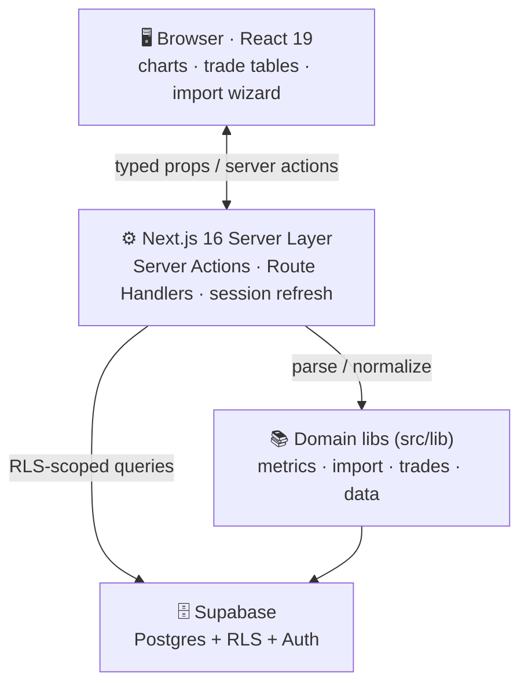

<div align="center">

# 📓 Trades Journal

### `multi-asset import` · `trade reconstruction` · `data-dense React dashboard`

**A trading journal: import broker/exchange executions, reconstruct every trade with exact decimal math, and see honest per-trade metrics on your edge.**
*יומן מסחר: ייבוא ביצועים מברוקר/בורסה, שחזור כל עסקה בחשבון עשרוני מדויק, ומדדים כנים ברמת העסקה על ה-edge שלך.*

<br/>


<br/>


</div>

> 🔓 **Sanitized public mirror** of a private production codebase (`acTrade`). No secrets in
> source or Git history — all credentials injected at runtime via env vars / platform secret
> stores ([`.env.example`](./.env.example)). Wire it to your own Supabase project to run it.

---

## 🌍 What is this? · מה זה?

<table>
<tr>
<td width="50%" valign="top">

### 🇬🇧 English

A **trading-journal web app**. Traders import their broker/exchange execution
history; the app reconstructs every trade (average-cost, walk-to-flat), computes
performance analytics, and renders them in a dark, data-dense dashboard.

Most traders never measure their own behavior. By turning raw executions into
**honest, per-trade metrics**, the journal makes the source of P&L visible and
improvable.

**For** active retail traders across crypto (Binance/Coinbase/Bybit), CFD/forex
(MT4/MT5), futures (CME/CBOT/NYMEX/COMEX), and equities.

Built to demonstrate production-grade **full-stack SaaS engineering**: strict type
safety end-to-end, secure auth via Postgres Row-Level Security, exact decimal money
math, and a clean separation of code from configuration.

</td>
<td width="50%" valign="top">

<div dir="rtl">

### 🇮🇱 עברית

**אפליקציית יומן מסחר.** סוחרים מייבאים היסטוריית ביצוע מהברוקר/בורסה; האפליקציה
משחזרת כל עסקה (עלות ממוצעת, walk-to-flat), מחשבת אנליטיקת ביצועים ומציגה אותה
בדשבורד כהה וצפוף-נתונים.

רוב הסוחרים לא מודדים את ההתנהגות של עצמם. בהפיכת ביצועים גולמיים ל**מדדים כנים
ברמת העסקה**, היומן הופך את מקור ה-P&L לגלוי ולבר-שיפור.

**מיועד** לסוחרים קמעונאיים בקריפטו (Binance/Coinbase/Bybit), CFD/פורקס (MT4/MT5),
חוזים עתידיים (CME/CBOT/NYMEX/COMEX) ומניות.

נבנה להדגמת **הנדסת SaaS פול-סטאק** ברמת production: בטיחות-טיפוסים קפדנית מקצה
לקצה, אימות מאובטח דרך Row-Level Security של Postgres, חשבון כספי עשרוני מדויק,
והפרדה נקייה בין קוד לתצורה.

</div>

</td>
</tr>
</table>

---

## ✨ Features

| Feature | What it does |
|---------|--------------|
| 🔀 **Multi-asset import** | Binance/Coinbase/Bybit fills · MT4/MT5 HTML + CSV · futures (point-value) · generic CSV. Content-hash dedup; malformed rows reported. |
| 🧮 **Trade reconstruction** | Average-cost walk-to-flat: scale-in/out, shorts, position flips, fee proration. Exact decimal math (no float drift). |
| 📊 **Analytics** | Net P&L, win rate, profit factor, avg R-multiple, max drawdown (abs + %), equity curve, timezone-aware daily P&L calendar heatmap. |
| 📋 **Trade log** | Sortable, filterable (symbol/side/status), detail view with executions ladder + editable journal notes. |
| ⚙️ **Accounts & settings** | Multiple accounts, base currency, profile timezone driving the calendar. |
| 🔐 **Auth** | Google OAuth + email/password; Row-Level Security isolates every user's data. |

---

## 🧱 Stack

| Layer | Technology |
|-------|------------|
| Framework | **Next.js 16** App Router, Server Actions, Route Handlers, **Proxy** (not Middleware) |
| Language | **TypeScript 5** (strict) — typed end-to-end against the DB schema |
| UI | React 19 · Tailwind CSS 4 · `class-variance-authority` · shadcn-style primitives |
| Animation | Framer Motion 12 |
| Data viz | Recharts 3 |
| Tables | TanStack React Table 8 |
| Backend | Supabase Postgres + Row-Level Security + Auth |
| Validation | Zod 4 (parse-don't-validate at every boundary) |
| Precision | `decimal.js` — no float drift on monetary math |
| Import | PapaParse (CSV) + `node-html-parser` (MT4/MT5 statements) |
| Testing | Vitest 4 — **48 tests** over reconstruction, metrics, and the parsers |

---

## 🧬 Architecture



**Executions are the source of truth** (immutable fills). **Trades are derived**
(average-cost), with cached metric columns for fast dashboards. Re-imports dedup by
content hash, so they never double-count. The schema is multi-asset from the ground
up: `asset_class` + per-instrument `multiplier`, with futures carrying `point_value`
and `tick_size`.

---

## 🚀 Local development

```bash
# 1. Install
npm install

# 2. Configure — copy the template, fill in your own Supabase keys
cp .env.example .env.local

# 3. Run
npm run dev          # http://localhost:3000

# 4. Quality gates
npm run lint
npm test             # Vitest — 48 tests
npm run build        # production build / typecheck gate
```

**Prerequisites:** Node.js 20+ · a Supabase project (free tier is enough) — copy its
`URL` and `anon` key from **Settings → API** into `.env.local`. You also need to apply
the schema and RLS policies to your own project; this mirror ships the app code, not
the migrations.

---

<details>
<summary><b>🗂️ Directory map</b></summary>

<br/>

```
src/
├── actions/         Server Actions — auth, import, accounts, trades, profile, preferences
├── app/
│   ├── (dashboard)/ Authenticated shell: dashboard, trades[/id], import, accounts, settings
│   ├── auth/        OAuth callback Route Handler
│   └── login/       Public auth entry
├── proxy.ts         Next 16 Proxy — Supabase session refresh
├── components/
│   ├── charts/      Recharts wrappers (equity curve, drawdown, calendar)
│   ├── trades/      Sortable trade tables (TanStack + Framer Motion)
│   ├── import/      CSV / statement import wizard
│   ├── dashboard/   KPI cards, layout
│   ├── accounts/    Multi-account management
│   ├── settings/    User & preference configuration
│   ├── auth/        Auth forms
│   └── ui/          Reusable primitives (cva + tailwind-merge)
├── lib/
│   ├── supabase/    Browser + server clients (env-driven, RLS-aware)
│   ├── metrics/     Performance & risk calculations (decimal.js)
│   ├── import/      columns · fills · completed · metatrader · contracts · dedupe
│   ├── trades/      reconstruct · pnl
│   └── data/        Query layer
└── types/           Generated DB types + domain models
```

</details>

<details>
<summary><b>🛡️ Security & secret handling</b></summary>

<br/>

| Concern | Approach |
|---------|----------|
| Secrets in source | None. Source reads `process.env.*` only. |
| Secrets in Git history | None. Public mirror initialized clean. |
| `.env.local` | Gitignored. Never committed. |
| Browser-exposed key | Supabase anon key only — scoped by Row-Level Security. |
| Admin key | `SUPABASE_SERVICE_ROLE_KEY` server-only; never `NEXT_PUBLIC_`-prefixed. |
| Production injection | Vercel env vars / GitHub Actions secrets / Vault — not files. |

**Principles:** code/config separation · type safety to the database · security by policy
(RLS) not obscurity · monetary correctness (`decimal.js`) · validation at boundaries (Zod).

</details>

---

## 📌 Status & known limitations

The app is feature-complete for v1 — build, lint, and the 48-test suite are green. Tracked
limitations, stated rather than hidden:

- EU-locale numbers are not auto-detected (locale is per-import and explicit).
- Cross-batch incremental closes are not re-reconstructed.
- Futures `contract_expiry` is left null; `point_value` / `tick_size` are populated.
- The trade log is single-page (no pagination yet).

> ⚠️ This is **Next.js 16** — its APIs differ from older versions (Middleware → Proxy,
> async `cookies()`). Check the framework docs before writing framework code.

---

<div align="center">

**Built by [@www8351](https://github.com/www8351)** · Licensed under [MIT](LICENSE)

<sub>Executions are truth · trades are derived · no float drift on money · RLS everywhere.</sub>

</div>
