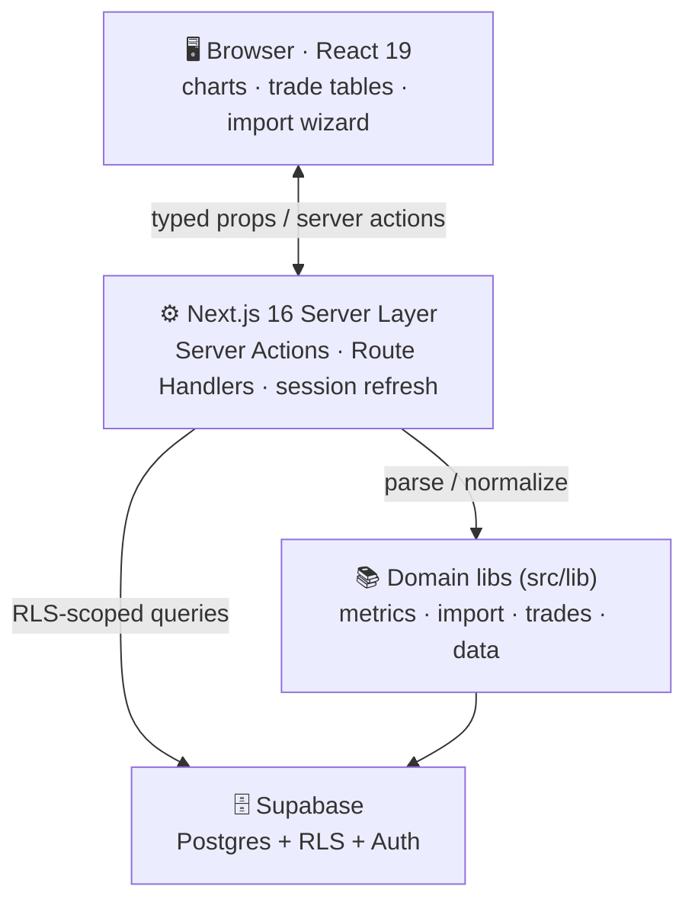

<div align="center">

# 🪞 Miror Copy Trades

### `real-time mirroring` · `multi-broker` · `data-dense React`

**Trade-copy analytics & mirroring dashboard for prop-firm and multi-broker accounts — import, normalize, and visualize execution data with strict end-to-end type safety.**
*דשבורד אנליטיקה ושיקוף עסקאות לחשבונות פרופ-פירם ומרובי-ברוקרים — ייבוא, נורמליזציה והצגה של נתוני ביצוע עם בטיחות-טיפוסים מקצה לקצה.*

<br/>


<br/>


</div>

> 🔓 **Sanitized public mirror** of a private production codebase. No secrets in source or Git
> history — all credentials injected at runtime via env vars / platform secret stores
> ([`.env.example`](./.env.example)). Wire it to your own Supabase project to run it.

---

## 🌍 What is this? · מה זה?

<table>
<tr>
<td width="50%" valign="top">

### 🇬🇧 English

A **real-time trade-copy analytics & mirroring dashboard** for proprietary-firm and
multi-broker accounts. It imports execution data, **normalizes it across brokers**,
computes risk/performance metrics, and renders them through an animated, data-dense
React interface.

Built to demonstrate production-grade **full-stack SaaS engineering**: low-latency
data flows, strict type safety end-to-end, secure auth via Postgres Row-Level
Security, and a clean separation of code from configuration.

</td>
<td width="50%" valign="top">

<div dir="rtl">

### 🇮🇱 עברית

**דשבורד אנליטיקה ושיקוף עסקאות בזמן אמת** לחשבונות פרופ-פירם ומרובי-ברוקרים. מייבא
נתוני ביצוע, **מנרמל אותם בין ברוקרים**, מחשב מדדי סיכון/ביצועים ומציג אותם בממשק
React אנימטיבי וצפוף-נתונים.

נבנה להדגמת **הנדסת SaaS פ‏ול-סטאק** ברמת production: זרימות נתונים בזמן-תגובה נמוך,
בטיחות-טיפוסים קפדנית מקצה לקצה, אימות מאובטח דרך Row-Level Security של Postgres,
והפרדה נקייה בין קוד לתצורה.

</div>

</td>
</tr>
</table>

---

## 🧱 Stack

| Layer | Technology |
|-------|------------|
| Framework | **Next.js 16** — App Router, Server Actions, Route Handlers |
| Language | **TypeScript 5** (strict) — typed end-to-end against the DB schema |
| UI | React 19 · Tailwind CSS 4 · `class-variance-authority` · shadcn-style primitives |
| Animation | Framer Motion 12 |
| Data viz | Recharts 3 |
| Tables | TanStack React Table 8 (sort, filter, virtualization-ready) |
| Backend | Supabase — Postgres + Row-Level Security + Auth |
| Validation | Zod 4 (parse-don't-validate at every boundary) |
| Precision | `decimal.js` — no float drift on monetary math |
| Import | PapaParse — streaming CSV ingest of broker statements |
| Testing | Vitest 4 |

---

## 🧬 Architecture



---

## 🚀 Local development

```bash
# 1. Install
npm install

# 2. Configure — copy the template, fill in your own Supabase keys
cp .env.example .env.local

# 3. Run
npm run dev          # http://localhost:3000

# 4. Quality gates
npm run lint
npm test             # Vitest
npm run build        # production build
```

**Prerequisites:** Node.js 20+ · a Supabase project (free tier is enough) — copy its
`URL` and `anon` key from **Settings → API** into `.env.local`.

---

<details>
<summary><b>🗂️ Directory map</b></summary>

<br/>

```
src/
├── actions/         Server Actions — auth + mutations (no secrets in source)
├── app/
│   ├── (dashboard)/ Authenticated app shell + routes
│   ├── auth/        OAuth callback Route Handler
│   └── login/       Public auth entry
├── components/
│   ├── charts/      Recharts wrappers (equity curve, drawdown, distribution)
│   ├── trades/      Animated, sortable trade tables (TanStack + Framer Motion)
│   ├── import/      CSV import wizard (PapaParse)
│   ├── dashboard/   KPI cards, layout
│   ├── accounts/    Multi-account / multi-broker management
│   ├── settings/    User & risk-rule configuration
│   └── ui/          Reusable primitives (cva + tailwind-merge)
├── hooks/           Typed React hooks
├── lib/
│   ├── supabase/    Browser + server clients (env-driven, RLS-aware)
│   ├── metrics/     Performance & risk calculations (decimal.js)
│   ├── import/      Broker-statement parsing & mapping
│   ├── trades/      Cross-broker trade normalization
│   └── data/        Query layer
└── types/           Generated DB types + domain models
```

</details>

<details>
<summary><b>🛡️ Security & secret handling</b></summary>

<br/>

| Concern | Approach |
|---------|----------|
| Secrets in source | None. Source reads `process.env.*` only. |
| Secrets in Git history | None. Public mirror initialized clean. |
| `.env.local` | Gitignored. Never committed. |
| Browser-exposed key | Supabase anon key only — scoped by Row-Level Security. |
| Admin key | `SUPABASE_SERVICE_ROLE_KEY` server-only; never `NEXT_PUBLIC_`-prefixed. |
| Production injection | Vercel env vars / GitHub Actions secrets / Vault — not files. |

**Principles:** code/config separation · type safety to the database · security by policy
(RLS) not obscurity · monetary correctness (`decimal.js`) · validation at boundaries (Zod).

</details>

---

<div align="center">

**Built by [@www8351](https://github.com/www8351)** · Licensed under [MIT](LICENSE)

<sub>No float drift on money · RLS everywhere · secrets never in source.</sub>

</div>
